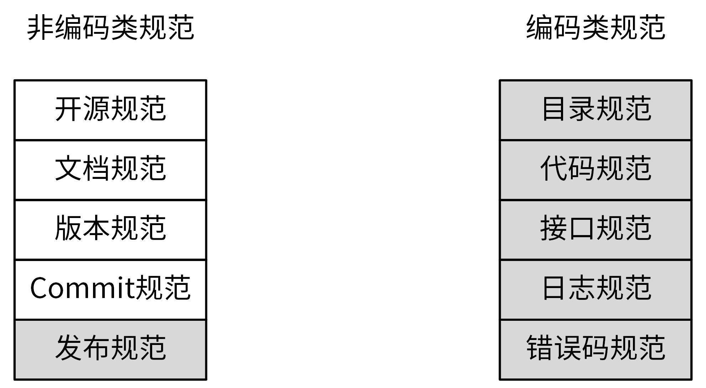
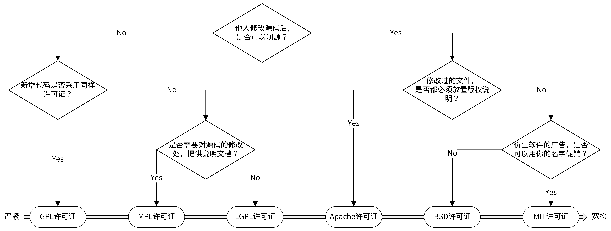
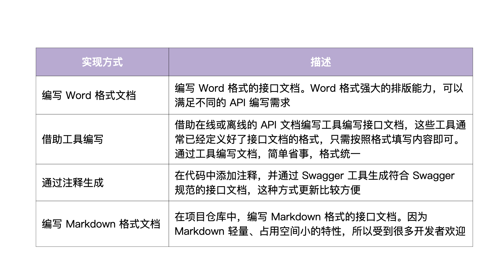

# 项目规范
- 非编码类规范，主要包括开源规范、文档规范、版本规范、Commit 规范和发布规范。
- 编码类规范，则主要包括目录规范、代码规范、接口规范、日志规范和错误码规范。


## 开源规范
### 开源协议概述
- 常使用的 6 种开源协议，也就是 GPL、MPL、LGPL、Apache、BSD 和 MIT 介绍：https://github.com/marmotedu/geekbang-go/blob/master/%E5%BC%80%E6%BA%90%E5%8D%8F%E8%AE%AE%E4%BB%8B%E7%BB%8D.md


- 第一，开源项目，应该有一个高的单元覆盖率
- 第二，要确保整个代码库和提交记录中，不能出现内部 IP、内部域名、密码、密钥这类信息。否则，就会造成敏感信息外漏，可能会对我们的内部业务造成安全隐患
- 第三，当我们的开源项目被别的开发者提交 pull request、issue、评论时，要及时处理，一方面可以确保项目不断被更新，另一方面也可以激发其他开发者贡献代码的积极性
- 第四，好的开源项目，应该能够持续地更新功能，修复 Bug。
  https://github.com/marmotedu/geekbang-go/blob/master/%E5%BC%80%E6%BA%90%E8%A7%84%E8%8C%83%E8%AF%A6%E7%BB%86%E5%88%97%E8%A1%A8.md
  
## 文档规范
- 最需要的 3 类文档是 README 文档、项目文档和 API 接口文档

### README 规范
```

# 项目名称

<!-- 写一段简短的话描述项目 -->

## 功能特性

<!-- 描述该项目的核心功能点 -->

## 软件架构(可选)

<!-- 可以描述下项目的架构 -->

## 快速开始

### 依赖检查

<!-- 描述该项目的依赖，比如依赖的包、工具或者其他任何依赖项 -->

### 构建

<!-- 描述如何构建该项目 -->

### 运行

<!-- 描述如何运行该项目 -->

## 使用指南

<!-- 描述如何使用该项目 -->

## 如何贡献

<!-- 告诉其他开发者如果给该项目贡献源码 -->

## 社区(可选)

<!-- 如果有需要可以介绍一些社区相关的内容 -->

## 关于作者

<!-- 这里写上项目作者 -->

## 谁在用(可选)

<!-- 可以列出使用本项目的其他有影响力的项目，算是给项目打个广告吧 -->

## 许可证

<!-- 这里链接上该项目的开源许可证 -->
```
- README工具：https://readme.so/

### 项目文档规范
1. 开发文档：用来说明项目的开发流程，比如如何搭建开发环境、构建二进制文件、测试、部署等。
2. 用户文档：软件的使用文档，对象一般是软件的使用者，内容可根据需要添加。比如，可以包括 API 文档、SDK 文档、安装文档、功能介绍文档、最佳实践、操作指南、常见问题等。
- 规划好英文和中文 2 个版本
```

docs
├── devel                            # 开发文档，可以提前规划好，英文版文档和中文版文档
│   ├── en-US/                       # 英文版文档，可以根据需要组织文件结构
│   └── zh-CN                        # 中文版文档，可以根据需要组织文件结构
│       └── development.md           # 开发手册，可以说明如何编译、构建、运行项目
├── guide                            # 用户文档
│   ├── en-US/                       # 英文版文档，可以根据需要组织文件结构
│   └── zh-CN                        # 中文版文档，可以根据需要组织文件结构
│       ├── api/                     # API文档
│       ├── best-practice            # 最佳实践，存放一些比较重要的实践文章
│       │   └── authorization.md
│       ├── faq                      # 常见问题
│       │   ├── iam-apiserver
│       │   └── installation
│       ├── installation             # 安装文档
│       │   └── installation.md
│       ├── introduction/            # 产品介绍文档
│       ├── operation-guide          # 操作指南，里面可以根据RESTful资源再划分为更细的子目录，用来存放系统核心/全部功能的操作手册
│       │   ├── policy.md
│       │   ├── secret.md
│       │   └── user.md
│       ├── quickstart               # 快速入门
│       │   └── quickstart.md
│       ├── README.md                # 用户文档入口文件
│       └── sdk                      # SDK文档
│           └── golang.md
└── images                           # 图片存放目录
    └── 部署架构v1.png
```

### API 接口文档规范
- 接口文档又称为 API 文档，一般由后台开发人员编写，用来描述组件提供的 API 接口，以及如何调用这些 API 接口。

- 接口文档有四种编写方式，包括编写 Word 格式文档、借助工具编写、通过注释生成和编写 Markdown 格式文档。


- Markdown 优势： 
  1. 相比通过注释生成的方式，编写 Markdown 格式的接口文档，能表达更丰富的内容和格式，不需要在代码中添加大量注释。
  2. 相比 Word 格式的文档，Markdown 格式文档占用的空间更小，能够跟随代码仓库一起发布，方便 API 文档的分发和查找。
  3. 相比在线 API 文档编写工具，Markdown 格式的文档免去了第三方平台依赖和网络的限制。


