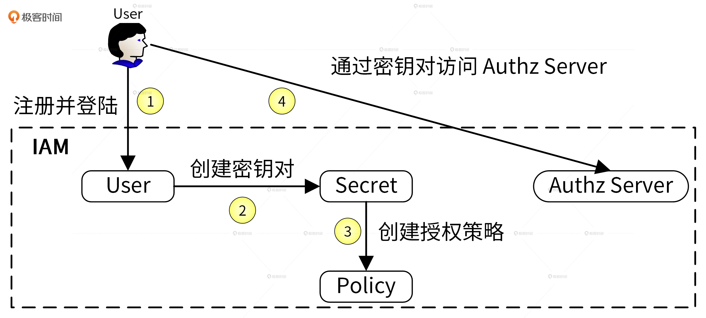
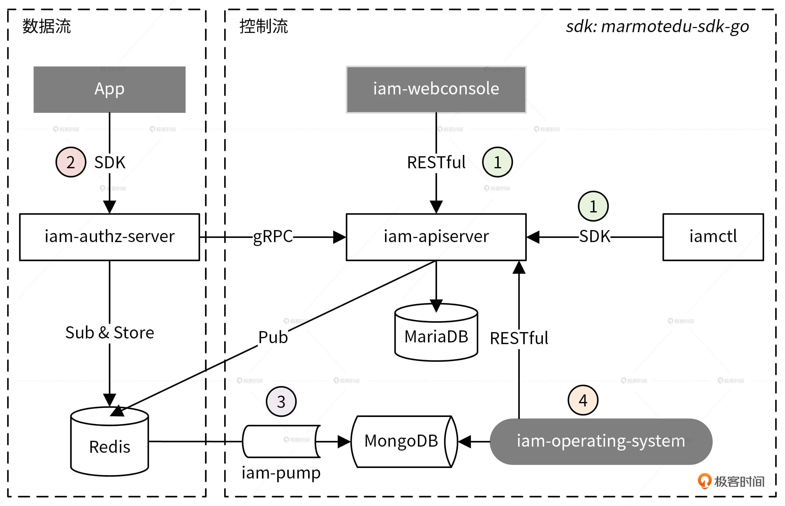
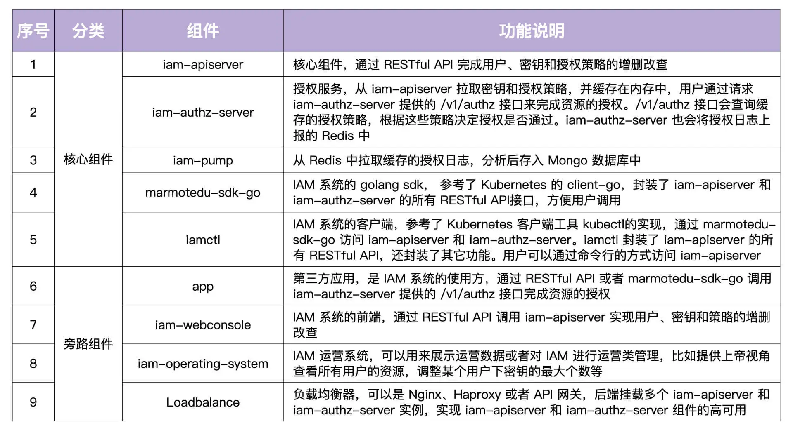
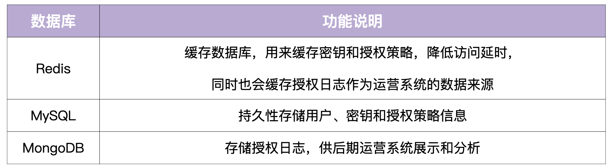

# iamlearn
## 项目背景：需要对访问进行认证，对资源进行授权
- **服务自身的安全**：为了保证服务的安全，需要禁止非法用户访问服务。这可以通过服务器层面和软件层面来解决。服务器层面可以通过物理隔离、网络隔离、防火墙等技术从底层保证服务的安全性，软件层面可以通过 HTTPS、用户认证等手段来加强服务的安全性。服务器层面一般由运维团队来保障，软件层面则需要开发者来保障。
- **服务资源的安全**：服务内有很多资源，为了避免非法访问，开发者要避免 UserA 访问到 UserB 的资源，也即需要对资源进行授权。通常，我们可以通过资源授权系统来对资源进行授权

## IAM（Identity and Access Management，身份识别与访问管理）
- IAM（Identity and Access Management，身份识别与访问管理）系统是用 Go 语言编写的一个 Web 服务，用于给第三方用户提供访问控制服务
- IAM 系统可以帮用户解决的问题是：在特定的条件下，谁能够 / 不能够对哪些资源做哪些操作（Who is able to do what on something given some context），也即完成资源授权功能。

- 流程：
  

1. 用户需要提供昵称、密码、邮箱、电话等信息注册并登录到 IAM 系统，这里是以用户名和密码作为唯一的身份标识来访问 IAM 系统，并且完成认证。
2. 因为访问 IAM 的资源授权接口是通过密钥（secretID/secretKey）的方式进行认证的，所以用户需要在 IAM 中创建属于自己的密钥资源。
3. 因为 IAM 通过授权策略完成授权，所以用户需要在 IAM 中创建授权策略。
4. 请求 IAM 提供的授权接口，IAM 会根据用户的请求内容和授权策略来决定一个授权请求是否被允许。

- IAM 使用到了 3 种系统资源：用户（User）、密钥（Secret）和策略（Policy）
1. 用户（User）：实现对用户的增、删、改、查、修改密码、批量修改等操作。
2. 密钥（Secret）：实现对密钥的增、删、改、查操作。
3. 策略（Policy）：实现对策略的增、删、改、查、批量删除操作。

## 系统架构

- AM 架构中包括 9 大组件和 3 大数据库。我将这些组件和功能都总结在下面的表格中。这里面，我们主要记住 5 个核心组件，包括 iam-apiserver、iam-authz-server、iam-pump、marmotedu-sdk-go 和 iamctl 的功能，还有 3 个数据库 Redis、MySQL 和 MongoDB 的功能。

